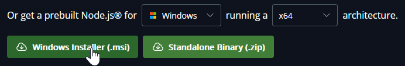
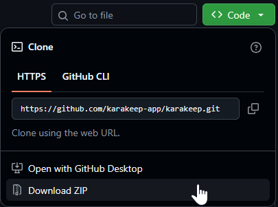

## Trackspot

Trackspot is a local-first album tracking app for Spotify users. It runs as a small Express server and serves a vanilla JavaScript app directly from `public/`.

Use it to keep a personal album collection, import albums from Spotify, browse your listening backlog, and customize the app with local themes and backgrounds. Trackspot stores its runtime data on your machine and is designed for local or trusted-network use.

## Installation on Windows

If you downloaded a Trackspot Windows portable ZIP from the releases page, you do not need to install Node.js. Extract it to where you want Trackspot to live.

If you downloaded the source ZIP from GitHub, install [Node.js](https://nodejs.org/en/download#:~:text=Or%20get%20a%20prebuilt%20Node%2Ejs,architecture%2E) first. It will be easiest to download and run the Windows Installer (.msi). You may need to restart your computer afterward.



Clone the repo if you know how, or, download the code as a ZIP file and extract it to where you want Trackspot to live.



Open the extracted Trackspot folder and double-click `Windows - Start Trackspot.bat`.

The first run will install Trackspot's dependencies, which can take a few minutes. After that, the same file starts Trackspot in the background and opens it in your default browser. If Trackspot is already running, it just opens the browser again.

Trackspot should now be running on port 1060. Connect at `http://localhost:1060` in your browser. When you want to stop the server, double-click `Windows - Stop Trackspot.bat`.

If Windows asks whether Node.js can access the network, allow it for private networks.

### Creating a Windows portable ZIP

To build a Windows x64 ZIP that includes portable Node.js, download the Node.js Windows x64 standalone ZIP, then run:

```powershell
npm run package:windows -- -NodeZipPath "C:\Users\Erik\Downloads\node-v24.15.0-win-x64.zip"
```

The package will be created at `dist/Trackspot-Windows-x64.zip`.

Running the same command again replaces the previous ZIP. By default the final ZIP keeps only the runtime files Trackspot needs from Node.js; add `-KeepFullNodeRuntime` if you want to include the full Node.js standalone ZIP contents for debugging.

## Installation on Linux

Install [Node.js](https://nodejs.org/en/download). Trackspot supports `>=20.19 <26` and was tested with v24 LTS.

Then:

```bash
sudo apt-get update
sudo apt-get install -y git ca-certificates build-essential python3
```

Then download/clone the repository somewhere and run npm install.

It is recommended to install Trackspot under a new Linux account. The following command is for a Linux user account with the name "spotty". If you are running the command as-is, either create that account first, or replace `/home/spotty/trackspot` with your preferred install path.

```bash
git clone -b master https://github.com/eao/trackspot.git /home/spotty/trackspot && cd /home/spotty/trackspot && npm install
```

Then start the server:

```bash
npm start
```

Trackspot should now be running on port 1060. Connect at `http://localhost:1060` if you are running this on desktop Linux. For more detailed configuration info, see the [Configuration](#configuration) section.

### Installation note for macOS

On macOS, install the Xcode command line tools and use Homebrew to install Git, Node.js, and npm:

```bash
xcode-select --install
brew install git node
```

Then clone the repository, run `npm install`, and start the server with `npm start` as shown above.

## Spicetify Extension


## Configuration

Trackspot works out of the box for local use. For host/port settings, data directory placement, home-server notes, CORS, upload limits, and security-related guidance, see [CONFIG.md](CONFIG.md).

Trackspot has no authentication layer. If you make it reachable beyond your own machine, put it behind a VPN, reverse proxy, or another access-control setup you trust.

## License

Trackspot is licensed under the MIT License. See [LICENSE.md](LICENSE.md).
