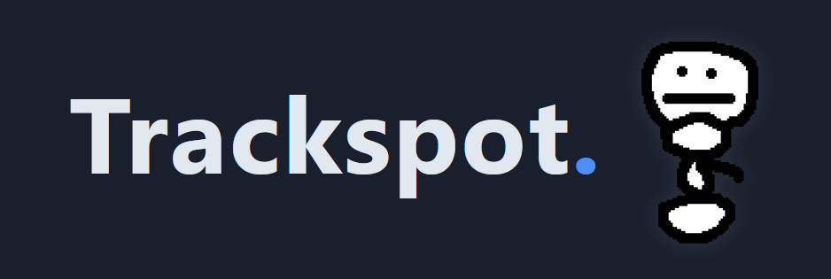
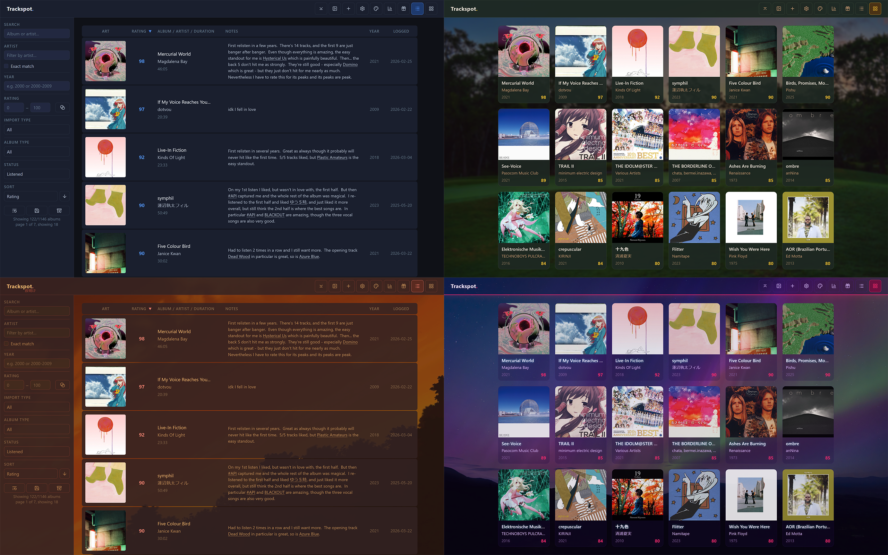
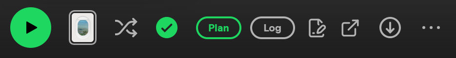
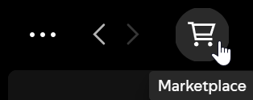
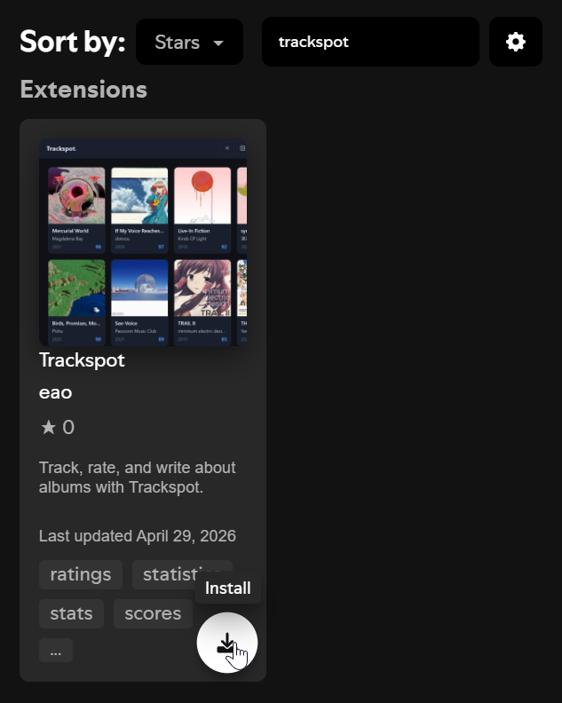
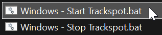

## 

Trackspot is a highly-customizable, self-hosted album tracking app.




It can be used as-is, or in tandem with its Spicetify extension, which links its tracking functionality directly into Spotify. No Premium required.



Trackspot makes it easy to keep track of the albums you listen to, with 100-point ratings and personal notes put front-and-center. Auto-log any album you listen to in Spotify, then browse your collection in list view or grid view. See your stats on the Stats page, or get a year-end wrap-up on the Wrapped page. Export your data at any time as a database backup or as a .CSV for putting in a spreadsheet.

## Spicetify Extension

Trackspot can keep track of your albums even if you don't use Spotify, but is most useful alongside its Spicetify extension. Install Spicetify [here](https://spicetify.app/#install).

Once you have Spicetify installed in Spotify, open up the Spicetify Marketplace by clicking on the shopping cart button in the upper-left.



Once in the Marketplace, search for Trackspot. If you don't see it, hit "Load more" and it should come up. Then, hit "Install".



Or, if you like doing things the old-fashioned way, you can install `trackspot-spicetify.js` manually via the instructions [here](https://spicetify.app/docs/customization/extensions).

## Installation on Windows

Download the latest Windows Trackspot release by clicking [HERE](https://github.com/eao/trackspot/releases/latest/download/Trackspot-Windows-x64.zip). After it downloads, extract the contents of the .zip file to where you want Trackspot to live.

Then, open the extracted Trackspot folder and double-click `Windows - Start Trackspot.bat`.



The first run will install Trackspot's dependencies, which can take a few minutes. If Windows asks whether Node.js can access the network, allow it for private networks. 

After that, Trackspot will start in the background and open it in your default browser. If you double-click `Windows - Start Trackspot.bat` when Trackspot is already running, it will just open the browser to Trackspot again.

And, when you want to stop Trackspot, double-click `Windows - Stop Trackspot.bat`.


## Installation on Linux

Install [Node.js](https://nodejs.org/en/download). Trackspot supports `>=20.19 <26` and was tested with v24 LTS.

Then:

```bash
sudo apt-get update
sudo apt-get install -y git ca-certificates build-essential python3
```

Then download/clone the repository somewhere and run npm install.

It is recommended to install Trackspot under a new Linux account. The following command is for a Linux user account with the name "spotty". If you are running the command as-is, either create that account first, or replace `/home/spotty/trackspot` with your preferred install path.

```bash
git clone -b master https://github.com/eao/trackspot.git /home/spotty/trackspot && cd /home/spotty/trackspot && npm install
```

Then start the server:

```bash
npm start
```

Trackspot should now be running on port 1060. Connect at `http://localhost:1060` if you are running this on desktop Linux. For more detailed configuration info, see the [Configuration](#configuration) section.

### Installation note for macOS

On macOS, install the Xcode command line tools and use Homebrew to install Git, Node.js, and npm:

```bash
xcode-select --install
brew install git node
```

Then clone the repository, run `npm install`, and start the server with `npm start` as shown above.


## Configuration

Trackspot works out of the box for local use. For host/port settings, data directory placement, home-server notes, CORS, upload limits, and security-related guidance, see [CONFIG.md](CONFIG.md).

Trackspot has no authentication layer. If you make it reachable beyond your own machine, put it behind a VPN, reverse proxy, or another access-control setup you trust.

## License

Trackspot is licensed under the MIT License. See [LICENSE.md](LICENSE.md).
