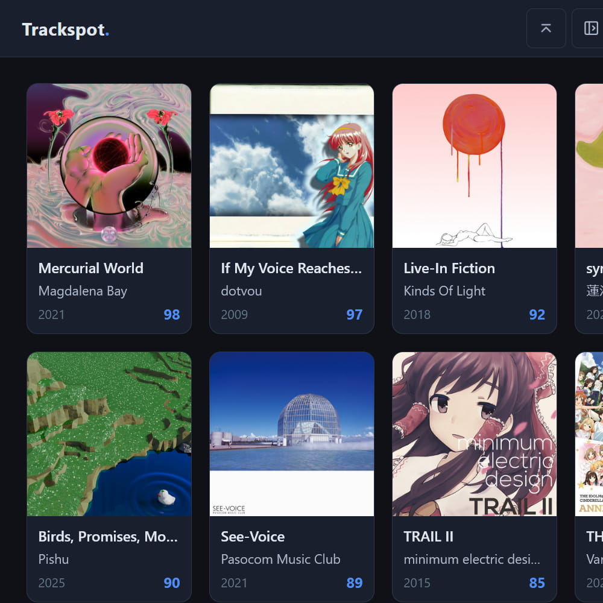
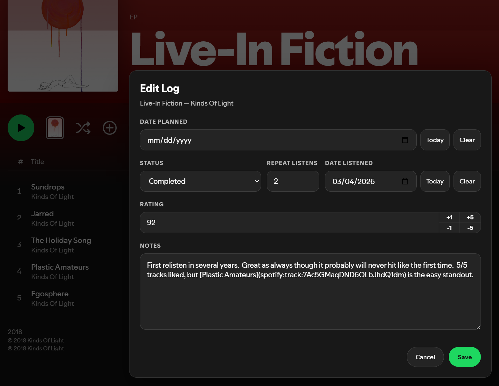
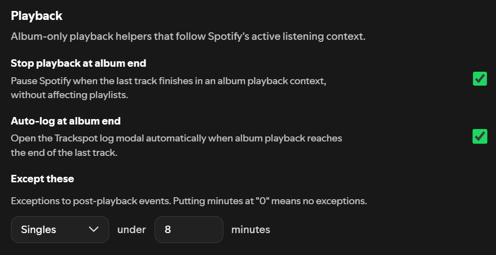
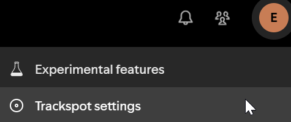

# Trackspot for Spicetify

Trackspot is a local-first album tracking app for Spotify users. It gives you a place to log albums, add ratings and notes, browse your collection, review listening stats, and export or back up your data from your own machine. You can install it at https://github.com/eao/trackspot.

This Spicetify extension connects Spotify Desktop to your Trackspot app so you can log albums while you are already browsing and listening in Spotify.



## What It Does

- Adds Trackspot actions on Spotify album pages for planning, logging, editing, and opening albums in Trackspot.


- Lets you log albums from within Spotify, then automatically syncs with Trackspot.



- Plus automatic library syncing, automatic logging, and more! Install it and check out the welcome tour to learn about all the things Trackspot can do.



## Requirements

Trackspot for Spicetify doesn't do much without a Trackspot server to connect to. By default, the extension looks for Trackspot locally at:

```text
http://localhost:1060
```

If your Trackspot server is running somewhere else, open the Trackspot settings menu inside Spotify and update the server URL.



So if you haven't already, install Trackspot by following the instructions at https://github.com/eao/trackspot, and get tracking!